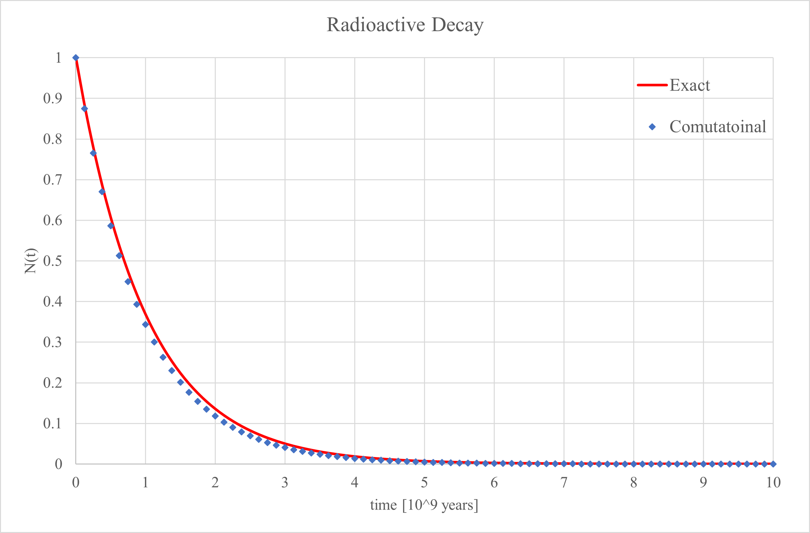

## Radioactive Decay

In this exercise, we aim to simulate the alpha decay of uranium. Based on the equations we have derived, we will write the code for relatively short time intervals and, ultimately, plot the number of undecayed uranium atoms over time using the obtained data. Additionally, we will compare these obtained values from the approximate equation with the values derived from the exact equation by solving the differential equation.

 

 
     
</dev>

</dev> 
The red curve represents the analytical solution, while the blue points correspond to the numerical solution. Since our time intervals were not very small (1/8), we observe a slight discrepancy. However, if we reduce the interval length, this difference will become significantly smaller.

As evident from the graph and numerical values, the numerical solution declines more rapidly. This is because, in our numerical approximation, we ignored second-order and higher-order terms. As a result, the obtained values are lower than the actual values, leading to a steeper decline in the trend of the graph.

