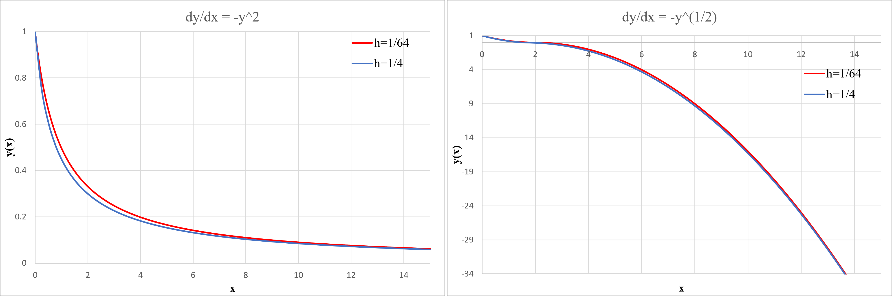

## Instability

In this exercise, we aim to analyze the **instability of the computed solution** caused by discretization.  
We consider the same first-order equation from the previous exercise and replace its expression with two other terms.

* $\frac{dy}{dx} = -y^2$
* $\frac{dy}{dx} = -\sqrt{|y|}$

The solutions to these two equations, obtained through **analytical methods**, are respectively as follows:

* $y = \frac{1}{1+x}$
* $y = (1- \frac{1}{2} x)^2$

Now, let's solve the equations using the **first-order Euler method** and analyze the instabilities present in them. The discretization of these equations, following the stated method, can be seen below.

* $y_{n+1} = y_{n} - h y_{n}^2$
* $y_{n+1} = y_{n} -h \sqrt{|y_{n}|}$

In the **first case**, since $y_{n} > h y_{n}^2$ always holds, we can claim that stability is maintained.
However, for the **second equation**, since $y_{n}$ is constantly decreasing, it will eventually reach the point where $y_{n} = h \sqrt{y_{n}}$. This means that instability will begin at $y_{n} = h^2$.

Our results show that the first equation remains stable when solved using the first-order Euler method.
However, for the second equation, as the value of $y$ decreases, it eventually reaches a point where $y < h^2$. At this stage, $\sqrt{y} < h$, leading to: $y - h\sqrt{y} < 0$ Thus, $y_{n+1} = y_n - h\sqrt{y_n} < 0$ Once this occurs at one step, it will continue to propagate in subsequent steps, causing $y$ to become increasingly negative.

It can also be observed that this instability (i.e., the emergence of the negative branch) depends on the point where $y < h^2$. This means that the smaller the value of $h$, the later the instability will appear.

The obtained graphs from this simulation clearly illustrate the stated observations.

 

  </dev>

</dev>
 

The left-side graph, corresponding to the first differential equation, remains stable, while instability is observed only in the right-side graph.
Additionally, it is evident that in the right-side graph, the red curve (which corresponds to a **smaller value of $h$**) experiences the onset of instability earlier compared to the blue curve.

