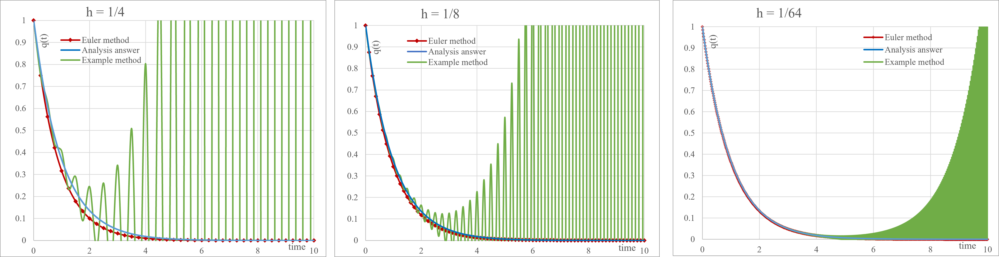
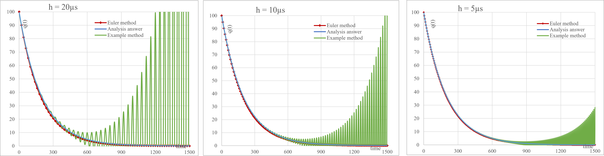

## RC Discharging

In this exercise, we aim to simulate an RC circuit. Initially, switch *S* is closed, and a capacitor with a capacitance of $10 \mu s$ is charged by a $10 V$ source. Then, at $t = 0$, the switch is opened, and the capacitor begins to discharge.
From electromagnetism, we know that the charge discharge process in such a circuit follows an exponential decay, and it is given by the following equation:

$R \dot{q} = -\frac{q}{C} \rightarrow q = Q_{0} e^{-\frac{t}{RC}}$

In the equation above, $R$ represents the circuit resistance, $C$ is the capacitance of the capacitor, and $Q_{0}$ is the initial charge on the capacitor, which is determined using the equation: $Q = VC$

  
For this simulation, I used the first-order Euler approximation along with the method described in the example from the lecture notes. Finally, I compared the stability of these two methods.

The program code has been written in two parts: one using a **reduced unit system**, and the other using the **SI unit system**.
For the SI unit system, the program retrieves user-provided data (such as source voltage, resistance value, capacitance, maximum time, and Euler approximation step size $h$) from a separate file.
Then, using both the first-order Euler method and the method described in the example from the lecture notes, the program calculates and stores the remaining charge in the capacitor over time in another separate file.

Finally, the simulation graphs for both cases (the reduced unit system and the SI unit system) have been plotted for different values of $h$ and are shown below

 

  </dev>

</dev> 

In the reduced unit system, numerical variations are more pronounced, whereas in the SI unit system, the behavior appears more precise and tangible.

It is clearly observed that the Euler method has provided results that maintain stability and align well with analytical values.
However, the green curve, which corresponds to the method described in the example from the lecture notes, exhibits instability. Although reducing the step size $h$ has diminished fluctuations and instability (delaying its onset) the instability remains visible.

