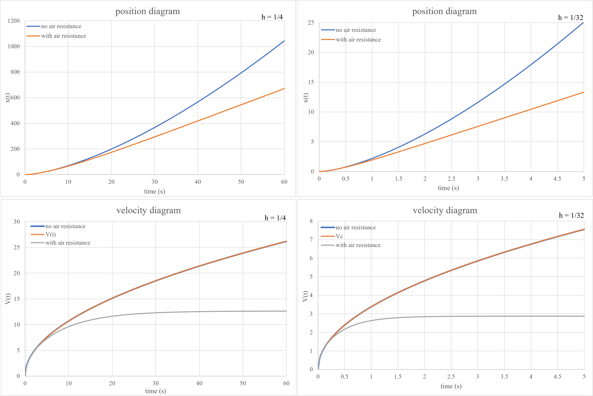

## Bicycle

In this exercise, we aim to analyze the motion of a bicycle. The free-body diagram for this problem is given as follows:

  </dev>

Where $F$ is the propulsive force, which depends on the cyclist's power, $f$ represents rolling friction, and $f_{D}$ is due to air resistance.

If we neglect resistance forces and consider a simplified classical case, the force equation will be as follows.

$F=ma \rightarrow \frac{P}{v} = m \frac{dv}{dt} \rightarrow v(t)= \sqrt{v_{0}^2+ \frac{2P}{m} t}$

In this case, as time progresses, the velocity increases continuously and tends toward infinity, which is due to the neglect of friction.
By considering friction, the equations will be as follows:

$\frac{P}{v} - \mu_{r} N-B_{1} v- \frac{1}{2} CρAv^2 = m \frac{dv}{dt}$

We can apply simplifying assumptions and omit certain terms to make the equations easier to solve.

$\rightarrow \frac{P}{v} - \frac{1}{2} CρAv^2 = m \frac{dv}{dt}$

By non-dimensionalizing the equation, we simplify our calculations and obtain:

$\rightarrow \frac{d\bar{v}}{dt} = \bar{v}^{-1} - \bar{v}^2 \rightarrow \frac{1}{2} \frac{d\bar{v}^2}{dt} = 1 - \bar{v}^3$

So, in the end, using the **Euler method**, our equations will be as follows.

$\begin{cases}
    \bar{v}_{n+1}^2 = \bar{v}_{n}^2 + 2h (1- \bar{v}_{n}^3 ) \\
    \bar{x}_{n+1} = \bar{x}_{n} + h \bar{v}_{n}
\end{cases}$

We were asked to write the simulation code and this time report the values in the familiar SI unit system. Therefore, we performed the calculations in the reduced unit system, then applied an inverse transformation to return to the SI unit system, and finally plotted the graphs in this system.

  
Here, the values of the cyclist's power $P$, the object's cross-sectional area $A$, air density $\rho$, the mass of the cyclist and bicycle $m$, and the value of h were read from a file in order. Then, using these values, the non-dimensionalization constants were obtained, and with these constants, the data was converted back to the SI unit system.  
Finally, the following values were stored in a separate file:
- Time
- Position without air resistance
- Velocity without air resistance
- Analytical solution for velocity without air resistance
- Position considering air resistance
- Velocity considering air resistance

The position and velocity graphs for two different values of $h = \frac{1}{4}$ and $h = \frac{1}{16}$ are shown below.

 

  </dev>

</dev> 

As the graphs show, when air resistance is absent, a greater distance is covered in a given time compared to the case where resistance is present. The reason is clear: with air resistance, the speed cannot exceed a certain terminal velocity, whereas in the absence of resistance, the speed increases at every moment, leading to greater growth in the position graph.  
Additionally, from the graphs, we observe that when air resistance is present, after a sufficient amount of time, position changes become linear. However, in the case of no air resistance, the position changes are almost parabolic.

It is also observed from the velocity graphs that, in the absence of air resistance, the numerical solution and analytical solution closely match, indicating that the Euler method is a stable and accurate approach for this simulation.  
In the case where air resistance is present, after approximately $30$ seconds, the velocity stabilizes, which corresponds to the terminal velocity. Based on the obtained values, the terminal velocity is approximately $12.6276$, which is almost equal to the constant $V_{c}$ $12.6415$ that was derived.

