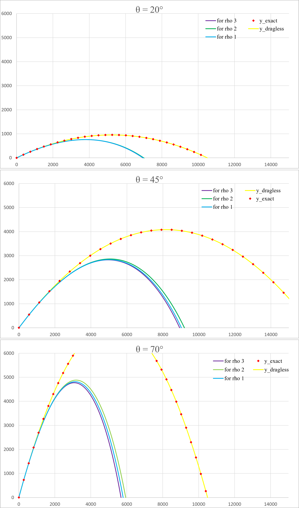
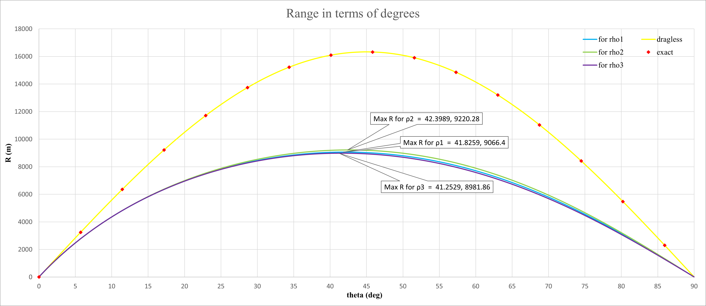

## Projectile Motion 

In this exercise, we aim to simulate the motion of a projectile under almost realistic conditions. The force diagram for this model is as follows.

  </dev>

The object is launched with an initial velocity $v_{0}$, then, due to the forces of gravity and air resistance, it rises to a certain maximum height before returning to the ground.
During its descent, the gravitational force acts in the direction of motion, while (as always air) resistance opposes the motion.
The equations of motion for this projectile can be written as follows.

$m\dot{v}_{x}^2(t)= -1/2 C\rho_{air} AV × V_{x}$  
$m\dot{v}_{y}^2(t)= -mg -1/2C\rho_{air} AV × V_{y}$

Where $V$ is the total velocity, and $V_x$ and $V_y$ are the velocity components in the $x$ and $y$ directions, respectively.
Additionally, $\rho$ represents air density, which can be determined using various methods. In this exercise, we have calculated it using three different approaches.

 

This time, we have been asked to perform the calculations in the **SI unit** system, considering the numerical values in the equations that are close to our system.
Now, based on the equation of motion and the Euler method, we will write the program code.

In this code, for ease of use and simpler modification, I read the constants from a file, and after performing the calculations, stored the results in a separate file.  
The second point is that I did not fully understand the professor’s intent regarding examining the results for each different $\rho$. Did this mean that all should be called in the `run` function and all results should be in one file, or was I only supposed to complete the different $\rho$ functions?  
For simplicity and to avoid defining too many variables, I only called one of the $\rho$ functions in the final function and renamed it for each case when checking different values. However, if I had wanted to write everything together, it wouldn't have been too difficult; I would only need to define a few additional variables.

 

The trajectory graphs for the projectile motion at three different angles (20°, 45°, and 70°) have been plotted for five different cases:
- Analytical solution without air resistance
- Numerical solution without air resistance
- Numerical solution with air resistance for three different values of $\rho$

These graphs illustrate how air resistance and launch angle influence the projectile's motion.

  </dev>

</dev> 

As the graphs show, the analytical and numerical solutions for the no air resistance case are very close, indicating that the **Euler method** is a stable approach for this simulation.
Additionally, as expected, the height and range in the presence of air resistance are lower than in the case without air resistance.
Another key observation from all three graphs is that the height and range are highest for the linear air density model and lowest for the adiabatic air density model.

 

The second part we were asked to examine was the projectile range as a function of the initial angle and to determine, based on the graphs, the angle that results in the maximum range.
I wrote this in a separate code file, where I read the constants from the same file and stored the results in another file.  
The **range vs. angle** graph is shown below.

  </dev>

</dev> 

Here, we know from the physics of the problem that the maximum range occurs at a 45-degree angle in the absence of air resistance. However, when air resistance is present, this is no longer the case.

