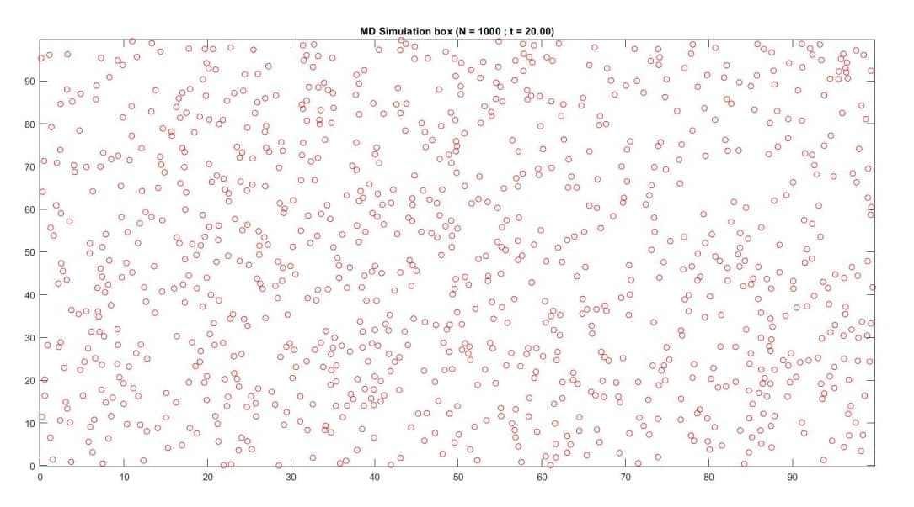
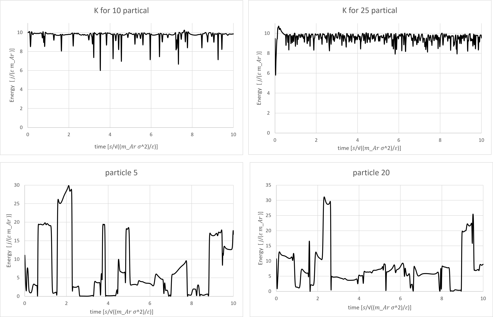

## Molecular Dynamics

In this exercise, we aim to accurately simulate the spatial motion of particles (atoms) in a box.
We focus on *argon atoms*, allowing us to ignore quantum effects acting on the particles.
In this scenario, the particles follow the **Lennard-Jones** potential in the box, which is expressed as follows.

  </dev>

$V(r) = 4\varepsilon ( (\frac{\sigma}{r})^{12} - (\frac{\sigma}{r})^6 )$ 

The first term originates from the **repulsive force**, which stems from the Pauli exclusion principle, while the second term represents the dipole-dipole interaction, serving as the source of the **attractive force**.
For simplicity, we can switch to the reduced unit system and rewrite the potential equation as follows.

$\overline{V}(r) = 4(\overline{r}^{-12} - \overline{r}^{-6} )$ 
* $\overline{V} = \frac{V}{\varepsilon}$
* $\overline{r} = \frac{\sigma}{r}$

From the gradient of this potential, we can derive the forces acting on the particles.
- $f_{x} = f \cos(\theta) = \frac{24 x}{r^2} (2r^-{12}-r^{-6} )$
- $f_{y} = f \sin(\theta) = \frac{24 y}{r^2} (2r^-{12}-r^{-6} )$

This force causes acceleration, leading to velocity and ultimately displacement of the particles.
The sign of the force can be determined by the distance $r$:
- If $r > 2^{-6}$, the force is **attractive**, so its sign is *negative*.
- If $r < 2^{-6}$, the force is **repulsive**, so its sign is *positive*.

One important consideration is that we cannot simulate the code for a large number of particles, and for fewer particles, surface effects become significant.
To eliminate these edge effects, we apply periodic boundary conditions.
By structuring the system as a grid, this issue will be resolved.

  </dev>

As seen in the figure above, the system is considered to be composed of many identical grids. We focus on a single grid, knowing that all grids behave similarly.
A notable point is that in each grid, when a particle exits, due to symmetry, a corresponding particle enters from the opposite direction.
Additionally, if particles are too far apart (approximately more than $3\sigma$), there is effectively no force between them. However, in this case, a force is applied to the corresponding particle in the neighboring grid.

 

For simulating this structure, we have used the **velocity-Verlet method**, as it ensures that energy remains conserved.

In this program, some coefficients are read from a file for convenience.  
Finally, the data is stored in two separate files:  
- **One file** for the **positions** of each particle over time.  
- **Another file** for storing the **energy** as a function of time.

It would be helpful to provide a brief explanation of each function:

1. `init()` initializes position, velocity, and acceleration of particles. Each particle starts in one-quarter of the box, and randomness is not a concern, as positions will soon randomize over time. Initial accelerations are derived from the Lennard-Jones force at the initial positions. Velocities are randomly selected, following a Gaussian distribution, and then scaled according to the box temperature.
2. `scale(T)` takes velocity values and scales them according to the environment temperature.
3. `update()` calculates position and velocity of all particles at each time step, based on acceleration, which is dependent on the Lennard-Jones force. Positions must be maintained inside the box so if a particle exits, a symmetrically placed particle enters from the opposite side.
4. `PB(x)` ensures particles remain inside the box, maintaining their positions.
5. `Acc(x, y, ax, ay)` calculates acceleration of each particle at every step, using inter-particle forces. If two particles are too far apart, the function considers a symmetrically corresponding particle in the adjacent grid to calculate forces accordingly.
6. `RD(delta)` measures force based on particle distance and, if the distance is too large, selects the appropriate corresponding particle.
7. `LJForce(dx, dy, fx, fy)` computes inter-particle forces using the gradient of the **Lennard-Jones potential**.
8. `ExportPath()` stores particle positions in both $x$ and $y$ directions in an output file.
9. `EK()` logs kinetic energy and time in two separate columns within a data file.

  

The following figure illustrates the placement of 1000 particles inside a box of length 100.

  </dev>

</dev> 

Additionally, to provide a better visualization and understanding, the following video has been prepared, showing the motion of 25 particles inside a box of length 10.

    <video width="600" autoplay muted controls loop>
        <source src='./Results/particle 25.mp4' type="video/mp4">
    </video> 
</dev>

</dev> 

 

To better understand the physical parameters of the problem, we have visualized the energy values.
The two upper graphs represent the average total energy of the system (displayed for 10 and 25 particles present in the environment).
The two lower graphs show the energy of two randomly selected particles over time.

  </dev>

</dev> 

That’s an important observation! The total energy of the system remains constant, with its average value matching the initial value.
This aligns perfectly with the **law of energy conservation**, if it were violated, energy would somehow be leaving or entering the system, which would be quite unexpected!
It’s fascinating how numerical simulations can confirm fundamental physical principles so clearly.

 

Additional Explanation:  
The **MATLAB file** (`Particle Display (MD).m`) included in the project is exclusively used to visualize particle motion over time.
This code loads the simulation results stored in the **.txt file**, then displays a real-time snapshot of the particle positions in the system.
