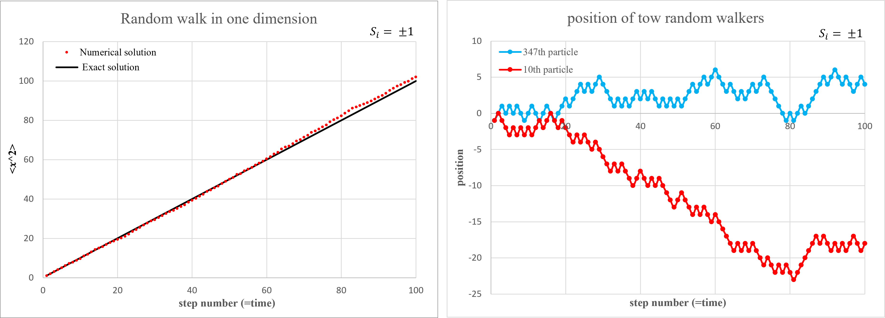
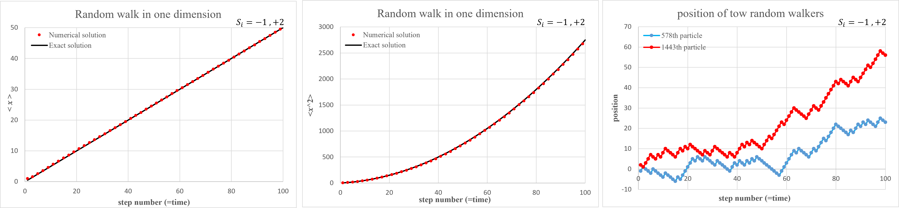

## Random Walk

In this exercise, we aim to present a visualization of random walk motion. The simplest form is one-dimensional movement, where the particle can only move forward or backward.
A schematic representation of this effect is shown below.

  </dev>

Based on the above figure, our random walker moves either one step forward or one step backward at each step.
Each of these steps is chosen completely randomly.
Ultimately, by performing ensemble averaging, we will observe that after n steps, the particle remains at its original position.
Mathematically, we express this as:

$<x_{n}> = <x_{0}> + < \sum_{i=1}^n S_{i} > , S_{i} = ±1$  
$\rightarrow <x_{n}> = x_{0} + \sum_{i=1}^n <S_{i}> = x_{0}$

But what is more interesting to us is the **mean square displacement** of the random walker, which is obtained as follows.

$<x_{n}^2> = <\sum_{i=1}^n S_{i} × \sum_{j=1}^n S_{j} >  = < \sum_{i=1}^n S_{i}^2 > + <\sum_{i≠j} S_{i} S_{j} >$  
$\rightarrow <x_{n}^2> = n+ \sum_{i≠j} <S_{i} S_{j}> = n$

This means that the graph changes in a completely linear manner with the number of steps, which corresponds to time.

  

Initially, we set the step length for both forward and backward movements to one unit, and the mean square displacement graph is shown below.

  </dev>

</dev> 

In the left graph, the numerically obtained values are represented as points, which are very close to the analytical values, corresponding to the $y = x$ graph (the identity function).
In the right graph, the movement of two sample particles is displayed.
We can see that one particle tends towards positive values while the other moves toward negative values.
However, when considering all $2000$ particles together, their average position remains close to zero.

 

Now, we can set different step lengths, for example, two units for forward movement and one unit for backward movement.
In this case, as expected, the mean displacement will no longer remain at zero, and the particle will tend to move more forward.
The graphs for this scenario are shown below.

  </dev>

</dev> 

* The left graph displays the average position, which, as expected from the analytical solution, follows the function $y = \frac{1}{2} x$.
The analytical solution for this case is as follows.

    $<x_{n}> = <x_{0}> + <\sum_{i=1}^n S_{i}> = x_{0} + \sum_{i=1}^n <S_{i}> , S_{i}= -1,+2$

    Since $S_{i}$ appears with equal probability, we can easily express it as follows:

    $\rightarrow <x_{n}> = x_{0} + \frac{n}{2}$

* The middle graph represents the mean square displacement, where the red points are obtained from the numerical solution, and the black line corresponds to the analytical solution.
In this case, the analytical solution is not linear but rather parabolic.
To compute this value using the analytical approach, we derive the following equation:

    $<x_{n}^2> = <x_{0}> + <\sum_{i=1}^n S_{i} \sum_{j=1}^n S_{j} > \rightarrow <x_{n}^2> = <\sum_{i=1}^n S_{i}^2 > + <\sum_{i≠j} S_{i}  S_{j} >$  
    $\rightarrow <x_{n}^2> =\sum_{i=1}^n <S_{i}^2> + \sum_{i≠j}<S_{i}  S_{j}>$

    Using the previous method, the first term is obtained easily. Since $i \neq j$, the variables $s_{i}$ and $s_{j}$ are independent. Thus, we have:

    $<x_{n}^2> = \frac{5}{2} n + \sum_{i≠j}<S_{i}>< S_{j}>$

    For large values of $n$, this quantity approaches the square of the mean position. Thus, we ultimately obtain:

    $<x_{n}^2> = \frac{5}{2} n + (\frac{n}{2})^2$

* And finally, the right graph displays the positions of two sample particles in this scenario.
Here, we can clearly observe the randomness of their movement, as well as the tendency of the particle to drift towards positive values, which is exactly what we expected.
