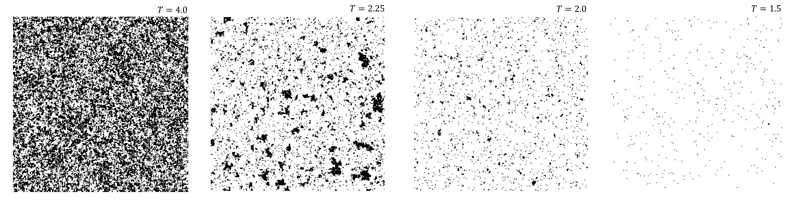
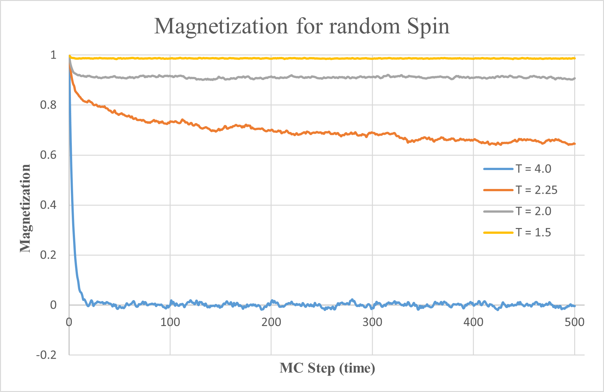
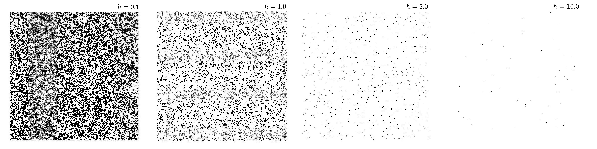
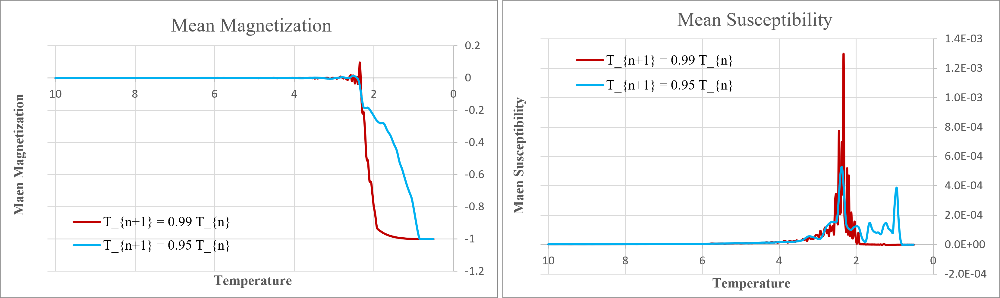

## Ising Model

In this exercise, we aim to study the magnetic behavior of materials in two dimensions using the Hamiltonian of the Ising model.
The Hamiltonian for this model is given as follows:

$H(S_{i})= -J \sum_{<i,j>} S_{i} S_{j} - \mu h \sum_{i} S_{i}$

Where $s_{i}$ and $s_{j}$ represent the z-component of spin, $J$ is the coupling constant, $\mu$ is the magnetic dipole moment, and $h$ denotes the external field.

The first term represents the **interaction between spins**, while the second term describes their **interaction with the external magnetic field**.
Since energy tends to minimize, for $J > 0$, spins prefer to align in the same direction.
For $J < 0$, neighboring spins alternate in opposite directions.
The first case is known as **ferromagnetism**, while the second case is called **antiferromagnetism**.

  </dev>

The above figure represents spins arranged in a lattice.
If we assume the lattice length is $L$, then the total number of spins will be $L × L$.
Thus, the configuration space will have $2^{L × L}$ possible states.
Additionally, as shown in the figure, each particle interacts only with its nearest neighbor.

An important point to consider here is that the steps taken in this model do not represent time; in other words, we do not track progress based on elapsed time.
Instead, we measure progress in terms of Monte Carlo steps.
Based on the interaction energy between neighboring spins, we introduce a change in the microstate.
This change follows these rules:
- If the initial state's energy is greater than the new state's energy, the transition occurs with $100\%$ probability.
- If the initial state's energy is lower, then the transition follows Boltzmann statistics, occurring with probability $e^{-ΔE/kBT}$.

The equation governing this transition is given as follows:

* $P( [S_{i}] \rightarrow [-S_i]) = 1 \qquad\quad  \Delta E<0$
* $P( [S_{i}] \rightarrow [-S_i]) = e^{\frac {\Delta E}{k_{B}T}} \qquad  \Delta E>0$

But what is more interesting to us is the **mean square displacement** of the random walker, which is obtained as follows.

$<x_{n}^2> = <\sum_{i=1}^n S_{i} × \sum_{j=1}^n S_{j} >  = < \sum_{i=1}^n S_{i}^2 > + <\sum_{i≠j} S_{i} S_{j} >$  
$\rightarrow <x_{n}^2> = n+ \sum_{i≠j} <S_{i} S_{j}> = n$

  

In the first part, we were asked to determine magnetization at specific temperatures and identify the number of steps required for thermal equilibrium to be established.
Finding this step count will be very useful for the second part, as we plan to change the temperature and need to know the minimum number of steps to wait before equilibrium is reestablished.

In this program, some parameters are read from a file for convenience.
Finally, the results are stored in two separate files:
- One file displays the **spin configurations**.
- The other file records **magnetization** as a function of Monte Carlo steps.

  

In the first part, the simulation is required to be performed at fixed temperatures with $S_{ij} = +1$.
The temperatures to be considered are **1.5**, **2.0**, **2.25**, and **4.0** in reduced units.
The following figures depict the schematic representation of spins at the specified temperatures.

  </dev>

</dev> 

The figures shown correspond to $2^{16}$ spins, simulated over 500 Monte Carlo steps.
As observed, at lower temperatures, the system tends to retain its initial state, maintaining its alignment in the $+1$ direction.
However, as the temperature increases beyond the critical temperature of $2.27$, thermal fluctuations cause the spins to randomly reorient.
This results in the magnetization dropping from $1$ to $0$.

A clearer visualization of this explanation can be seen in the following graph, which depicts magnetization as a function of Monte Carlo steps at the specified temperatures.

  </dev>

</dev> 

Just out of curiosity, instead of varying the temperature in different simulations, we changed the external magnetic field to observe how the spins respond in their alignment.

  </dev>

</dev> 

This observation reveals that the stronger the external magnetic field, the more stable the spin alignment remains, keeping the system's magnetization at $1$.
However, as the field strength decreases toward zero, thermal fluctuations cause the system to become randomized, leading to a magnetization of $0$.

 

In the second part of the question, the initial spin orientations are set randomly, and the system is analyzed as the temperature decreases from 10 to 0.5.
Observing magnetization and susceptibility over time is also valuable for understanding the system's behavior.
The following video illustrates spin orientations throughout the process of temperature reduction.

    <video width=80% autoplay muted controls loop>
        <source src='./Results/Spins.mp4' type="video/mp4">
        ./Results/Spins.mp4
    </video> 
</dev>

</dev> 

Clearly, as temperature decreases, the spins transition from a random configuration to a fully aligned state.
This causes the magnetization to shift from $0$ to $1$, reflecting the system's movement toward order and stability.

Additionally, the mean magnetization and susceptibility graphs shown below illustrate the transition point between the random and ordered states.
For this spin system, the transition can be reported at $2.27$.

  </dev>

</dev> 

Reducing the temperature in **smaller steps** significantly enhances the precision of the transition, providing a clearer view of the changes in the system

 

Additional Explanation:  
The **MATLAB file** (`Spin Display (video).m`) included in the project is solely for visualizing spin changes in the system over time.
This code reads the simulation results stored in a .txt file and provides a snapshot of the current spin configuration in the system.
